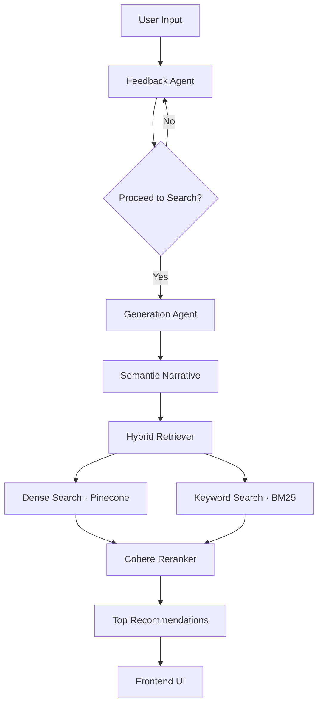

<div align="center">

# 🎬 SeMedia
### Discover films by how you feel, not how they're tagged.

    

[Demo](https://drive.google.com/file/d/1ggbeEyI951iqKfTdwmHpbisA_uOyKrrp/view?usp=drive_link) • [Docs](#) • [Report Bug](https://github.com/anomalyco/opencode/issues) • [Request Feature](https://github.com/anomalyco/opencode/issues)

</div>

## 📖 Overview

SeMedia is an AI-powered movie discovery engine designed to bypass the "infinite scroll" of traditional streaming platforms. Instead of relying on static ratings or rigid genre tags, SeMedia leverages a stateful, multi-agent AI pipeline to understand the user's current emotional state and cinematic craving.

The system treats movie discovery as a conversation. Rather than jumping straight to results, the AI first engages in a feedback loop to clarify the "vibe" of the request—whether it's "melancholy like a rainy Tuesday in Paris" or "intense and thought-provoking"—before synthesizing a semantic query to retrieve high-match films from a curated dataset.

The result is a curated list of recommendations that match an emotional fingerprint, providing a discovery experience that feels intuitive, human, and precisely aligned with the user's current mood.

## 📉 The Problem

Modern movie discovery is broken. Despite thousands of titles at our fingertips, users face three core friction points:
- **Choice Overload**: Infinite catalogs lead to decision paralysis; users spend more time scrolling than watching.
- **Static Algorithms**: Traditional "because you liked X" engines create echo chambers, repeatedly suggesting the same genres.
- **Mood Blindness**: No system asks how you *actually* feel right now. A user might love Horror but currently needs something "hopeful but a little melancholy."

SeMedia solves this by replacing keyword filters with a conversational agent that decodes emotional intent before retrieval.

## ✨ Features

- 🧠 **Conversational AI Engine** — A stateful LangGraph pipeline that clarifies user mood before recommending.
- 🔍 **Hybrid Retrieval** — Combines Pinecone dense vector search (70%) with BM25 keyword matching (30%) for maximum accuracy.
- 🎯 **Contextual Reranking** — Uses Cohere Rerank (Cross-Encoder) to refine the top 10 candidates into the final top 5.
- 🔄 **Session Persistence** — PostgreSQL-backed checkpointing restores conversation state and history across sessions.
- ⚡ **Multi-Model Fallback** — Primary inference via Groq (Llama 3.3) with automatic failover to OpenRouter.
- 🎭 **Cinematic Narrative Synthesis** — Converts casual chat into a detailed "imaginary movie description" for high-precision semantic search.
- 🔐 **Secure Authentication** — JWT-based auth with bcrypt password hashing and Google OAuth integration.

## 🏗️ Architecture

### System Flow



### Tech Stack

| Layer | Technology | Purpose |
|-------|-----------|---------|
| **AI Orchestration** | LangGraph | Stateful multi-agent workflow and checkpointing |
| **LLM Inference** | Groq / OpenRouter | Primary and fallback reasoning models |
| **Vector Store** | Pinecone | Dense vector retrieval of movie embeddings |
| **Keyword Search** | BM25 | Exact keyword matching for tags and titles |
| **Reranking** | Cohere | Cross-encoder for final relevance scoring |
| **Embeddings** | Ollama (Qwen3) | Converting text narratives into vector space |
| **Backend API** | FastAPI | High-performance asynchronous REST API |
| **Database** | PostgreSQL | User profiles, conversation logs, and recommendations |
| **Frontend** | React + Vite | High-performance UI with Tailwind & shadcn/ui |

## 📁 Project Structure

```
semedia/
├── backend/
│   ├── app/
│   │   ├── api/                # FastAPI routes (auth, chat, conversations)
│   │   ├── core/               # LangGraph state machine and agent nodes
│   │   │   ├── nodes/          # Feedback, Generation, and Retriever agents
│   │   │   └── edges/          # Conditional routing logic
│   │   ├── services/           # Business logic for AI and Retrieval
│   │   ├── db/                 # SQLAlchemy models and session management
│   │   ├── prompts/            # System prompts for AI agents
│   │   └── config.py            # Environment and model configuration
│   ├── scripts/                # Data ingestion pipeline for Pinecone
│   ├── data/                    # TMDB movie dataset (CSV/PKL)
│   ├── requirements.txt        # Python dependencies
│   └── test_main.py            # Backend server entry point
├── frontend/
│   ├── src/
│   │   ├── pages/              # Landing, Discover, Recommendations, Auth
│   │   ├── components/         # UI components and specialized SeMedia views
│   │   ├── contexts/           # Auth state management
│   │   └── lib/                # Axios API configuration and utilities
│   ├── package.json            # Node dependencies and scripts
│   └── vite.config.ts          # Vite build configuration
└── .env                        # Environment variables (redacted)
```

## 🚀 Getting Started

### Prerequisites

- **Python 3.11+**
- **Node.js 18+ / Bun**
- **PostgreSQL** (Local instance)
- **API Keys**: Groq, Pinecone, Cohere, OpenRouter, HuggingFace

### Installation

**1. Backend Setup**
```bash
cd backend
python -m venv venv
source venv/bin/activate  # Windows: venv\Scripts\activate
pip install -r requirements.txt
cp .env.example .env       # Configure API keys and DB credentials
```

**2. Local Data Ingestion**
*Run the ingestion script to populate your Pinecone index with the TMDB dataset:*
```bash
python -m scripts.ingest_knowledge
```

**3. Frontend Setup**
```bash
cd frontend
npm install                # or bun install
npm run dev
```

**4. Run Backend Server**
```bash
cd backend
python test_main.py
```
The API will be available at `http://localhost:8001`. Open `http://localhost:8001/scalar` for interactive API documentation.

## ⚙️ Configuration

| Variable | Required | Description | Example |
|----------|----------|-------------|---------|
| `GROQ_API_KEY` | ✅ | Primary LLM inference key | `gsk_...` |
| `PINECONE_API_KEY` | ✅ | Vector database access key | `pcsk_...` |
| `COHERE_API_KEY` | ✅ | Used for re-ranking results | `hqUT...` |
| `OPENROUTER_API_KEY` | ⚠️ | Fallback LLM provider key | `sk-or-...` |
| `DB_PASSWORD` | ✅ | PostgreSQL user password | `your_pass` |
| `SECRET_KEY` | ✅ | JWT signing secret | `env_secret...` |

## 💡 Usage

### The Discovery Flow
1. **Describe Your Mood**: Enter a prompt like `"I'm feeling lonely and want something that starts dark but ends with a glimmer of hope."`
2. **AI Clarification**: SeMedia AI will respond to confirm its understanding: `"Got it. You're looking for a slow-burn emotional journey that navigates through loneliness toward redemption. Do you want to proceed, or add more details?"`
3. **Proceed**: Click **"Find my film"**.
4. **Results**: The AI generates a semantic narrative, retrieves a set of movies via hybrid search, reranks them, and presents the top 5 matches with explanations.

### CLI Test Mode
You can test the agent logic without the UI:
```bash
cd backend
python main.py
```

## 📡 API Reference

### `POST /api/ai/chat`
Starts or continues a movie discovery session.

**Request Body:**
```json
{
  "message": "Something intense and thought-provoking",
  "thread_id": "optional-uuid",
  "proceed": false
}
```

**Response:**
```json
{
  "message": "I'll find you something that challenges your perception... Do you want to proceed?",
  "thread_id": "uuid-abc-123",
  "proceed": false,
  "recommendations": null
}
```

### `POST /api/auth/signup`
Creates a new user account.

**Request Body:**
```json
{
  "email": "user@example.com",
  "first_name": "Jane",
  "last_name": "Doe",
  "password": "securepassword123"
}
```

## 🤝 Contributing

Contributions are welcome. Please follow these steps:
1. Fork the repository.
2. Create a feature branch (`git checkout -b feature/your-feature`).
3. Commit changes (`git commit -m 'feat: add X functionality'`).
4. Push to the branch.
5. Open a Pull Request.

## 📄 License

Distributed under the MIT License. See `LICENSE` for more information.
